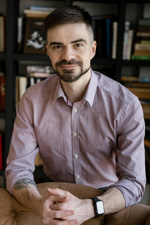

# Бахарев Артём Александрович

** Дата рождения:** 15.01.1990

** Город:** Санкт-Петербург

** Образование:** высшее техническое, Томский Университет Систем Управления и Радиоэлектроники (ТУСУР), факультет вычислительных систем, специальность «Управление и информатика в технических системах»

<nobr> <a href="tel:+79234040704">+7-923-404-0704</a></nobr>&emsp;
<nobr> <a href="https://t.me/mrthomasteller">@mrThomasTeller</a></nobr>&emsp;
<nobr> artyom.bakharev@gmail.com</nobr>&emsp;
<nobr> https://github.com/mrThomasTeller</nobr>

## Цель

Трудоустройство на должность `Scala Back-end` либо `Scala Full-stack` разработчика. Предпочтительно фулл-тайм в офисе в Санкт-Петербурге.

## Кратко

- 3 года опыта в Full-stack (`C#`, `PHP`, `MySQL`, `PostgreSQL`) и 10 лет опыта во Front-end (`TypeScript`, `React`, `Redux Toolkit`, `WebPack`, `Docker`)
- Руководил небольшим отделом Front-end разработки в компании ShareVault (США, https://sharevault.com)
- Был ведущим Front-end разработчиком в интернет-магазине с высокой посещаемостью (https://sotmarket.ru)
- По максимуму стараюсь придерживаться функциональной парадигмы, изучал `Haskell`, `Scala`, активно использовал ФП в разработке на `JS` / `TS`

## Ещё

- Есть опыт разработки по TDD (`Jest`), а также создания E2E тестов (`TestCafe`)
- Отлично владею `CSS`, `Styled Components`, `CSS-modules`, `SASS`, `БЭМ`;
- Большой опыт проектирования сложных программных продуктов (втч с применением UML), применяю принципы и паттерны проектирования в ООП и ФП (монады и т.д.);
- Ценю красивую программную архитектуру и борюсь за чистоту кода;
- Разговорный английский (на среднем уровне).

##  Опыт работы

_03.2022 - 08.2023:_ **Преподаватель, ментор Full-stack JavaScript/TypeScript разработки в школе Elbrus Bootcamp.** Также работал над учебной программой. `React`, `Redux Toolkit`, `NodeJS`, `Express JS`, `PostgreSQL`, `Docker`. https://elbrusboot.camp/

_08.2015 - 02.2022:_ **Team Lead Front-end разработчик в компании ShareVault** (США, удалённая работа). Отвечал за архитектуру и разрабатывал веб-интерсейс для облачного хранилища (в т.ч. мобильный). В разработке использовался чисто функциональный подход. `Ramda` (ФП для JS), `React`, `Redux`, `TypeScript`, `Styled Components`, `webpack`, `Jest` для Unit-тестирования, `TestCafe` для E2E тестирования. https://www.sharevault.com/

_11.2012 - 06.2015:_ **Head Front-end разработчик в интернет-магазине "Сотмаркет"** (Москва). `JS` (`jQuery`), `CSS` (`БЭМ`). [www.sotmarket.ru](http://web.archive.org/web/20150421092312/http://www.sotmarket.ru/)

_12.2011 - 10.2012:_ **Full-stack разработчик в компании "SibEDGE"** (Томск). Разработка редактора диаграмм, интерфейса системы управления криобанков и другие задачи. `JS` (`jQuery`, `Qooxdoo`), `C#` (`ASP.NET`, `ASP.NET MVC`). https://sibedge.team/

_10.2011 - 11.2011:_ **Full-stack-разработчик в компании UTS** (Универсальные Терминальные Системы, Томск). Разработка системы мониторинга городских платёжных терминалов. `PHP`, `PostgreSQL`, `C#` (`ASP.NET`), `JS` (`Qooxdoo`). https://unitsys.ru/

_01.2010 - 07.2011:_ **Full-stack разработчик в компании Avvea**, разрабатывающей новые технологии в интернет-рекламе (CPA). Управлял небольшой группой JS-разработчиков. Проектировка системы (UML). `PostgreSQL`, `JS` (`jQuery`, `ExtJS`), `C#`, `PHP`, `FreeBSD`. [avvea.ru](http://web.archive.org/web/20120521052046/http://avvea.ru/)

_2009:_ Фриланс (в основном **Full-stack веб-разработка**). `MySQL`, `PHP` (`Kohana`), `CSS`, `JS` (`jQuery`, `ExtJS`)
